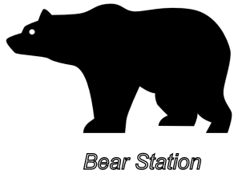
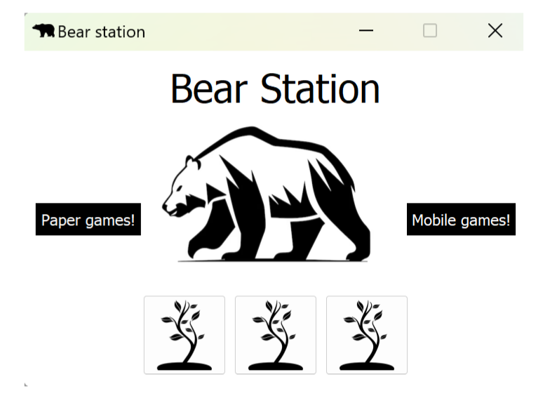
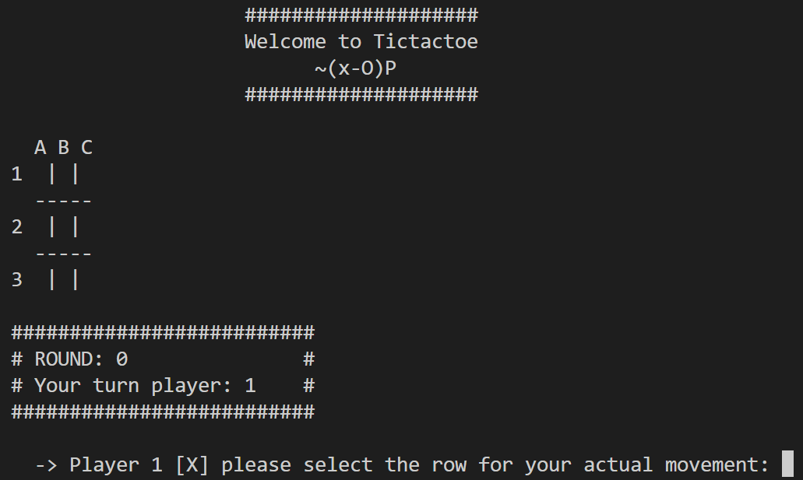

# Bear station
<p align="center">
        
</p>

This project is dedicated to implementing the logic and visual representations of paper games using Python and pyQt5. Each game consists of 2 main elements: 

1. [Game logic](https://github.com/jrojas9206/ClassicGames/tree/main/src/bearconsole/games)
2. [Ui-Widget](https://github.com/jrojas9206/ClassicGames/tree/main/ui) 

This project is a hobby, it will continue to be active and I hope that this year (2024 - 2025) I will be able to implement more games and improve the visuals, add some music and better animations as at the moment it is more like a skeleton.  The main UI can be seen in figure 1.


<figure>
    <p align="center">
        
    </p>
        <figcaption><b>Figure 1.</b> Main console</figcaption>

</figure>


The games can also be run on the terminal. An example of a game running on the console is shown in Figure 2.

<figure>
    <p align="center">
        
    </p>
    <figcaption><b>Figure 2.</b> TicTacToe Running on terminal</figcaption>
</figure>

## 1. Implemented games

The following games are currently available:
 - TicTacToe 
 - Hangman 
 - DotAndBoxes 

## Installation 

1. Create a virtual environment to install the project.

```bash
    python -m venv .bearconsole
```

2. Activate your virtual environment 

- GNU/Linux

```bash
    source .bearconsole/bin/activate 
```

-  Windows 

```bash
    ./bearconsole/Scripts/activate 
```

3. Install the build module 

```bash
    python -m pip install build
```

4. Build the project 

```bash 
    python -m build
```

5. Install the project 

```bash
    python -m pip install -e .
```

6. Run the app Qt/Terminal

- Terminal  

```bash
    python ./terminal_app.py 
```

- Qt app  

```bash
    python ./app.py 
```